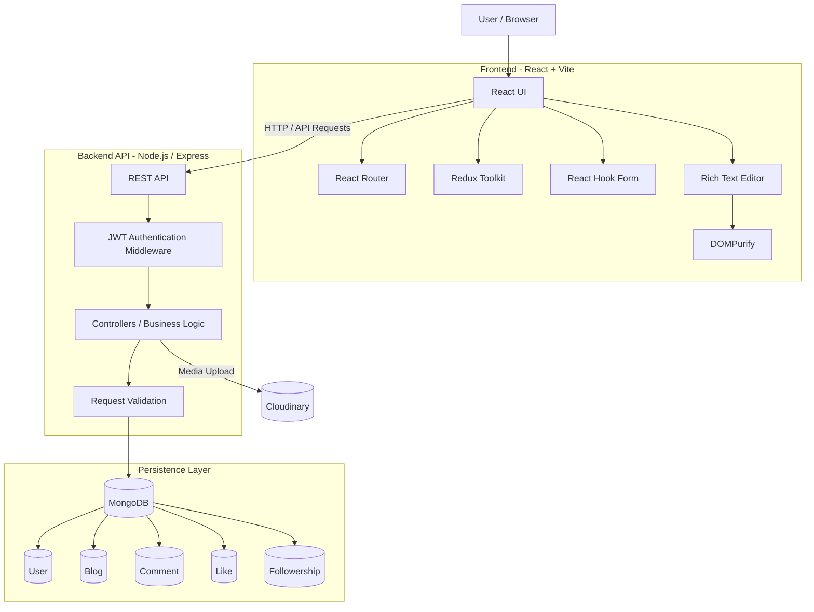
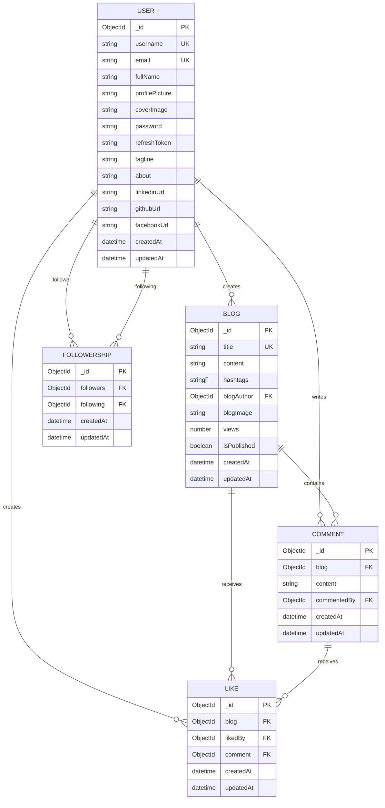
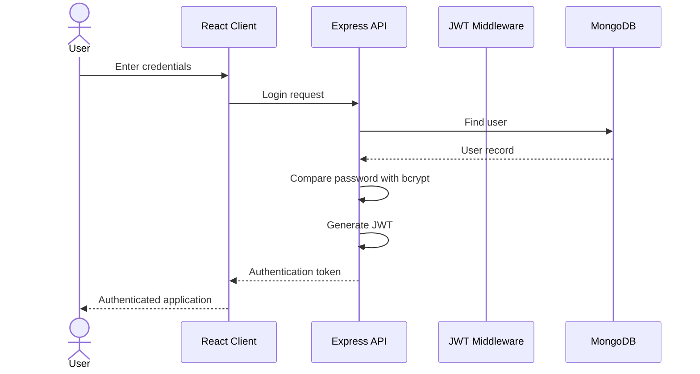
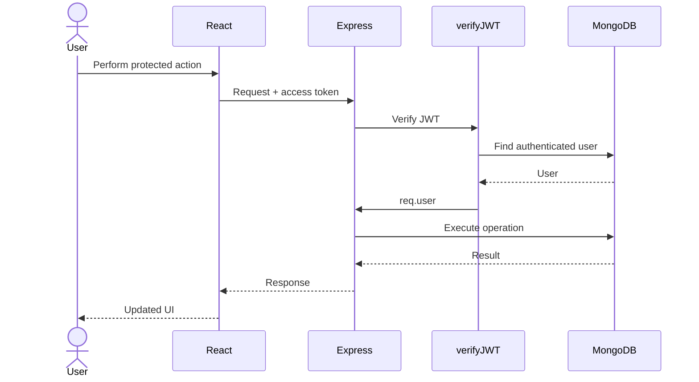
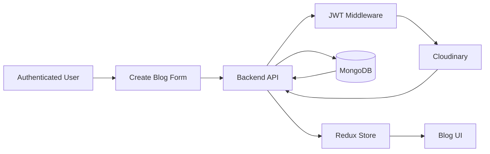
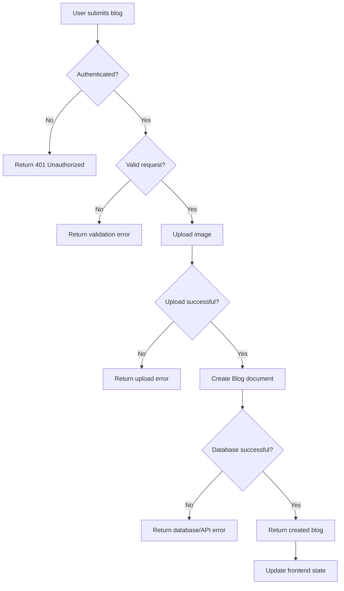

# Blogit 

<p align="center">
  <strong> A production-deployed full-stack blogging platform built around secure authentication, blog and comment CRUD operations, pagination, user profiles, follow relationships, search, media uploads, and protected API workflows.</strong>
</p>


<a href="https://www.youtube.com/watch?v=ljah7nqAYDk">
  
</a>


**Live Demo:** https://blogit-8bmo.vercel.app/


## 01. Overview

Blogit started as a simple idea: build a complete blogging platform where users could create and manage their own content while also interacting with content published by other users.

Instead of treating it as a collection of CRUD screens, I built it as a complete full-stack application with:

* Secure user authentication using JWT
* Password hashing and validation
* Protected API routes through authentication middleware
* Blog creation, reading, updating, and deletion
* Comment CRUD operations
* Blog search
* Server-side pagination
* User blog history
* User profiles and social links
* Followers and following relationships
* Likes for blogs and comments
* Image/file uploads through Cloudinary
* Rich-text blog content
* Client-side state management with Redux Toolkit
* Content sanitization using DOMPurify
* MongoDB data modeling with Mongoose
* Production deployment with Vercel

The project was also an opportunity to understand how the frontend, backend, authentication layer, database, media storage, and deployment environment work together as one system.

### Live Product

[Open the deployed application](https://blogit-8bmo.vercel.app/)


# 02. Project Goals

The goal was not only to build a blogging UI, but to design and deploy a complete application with realistic backend workflows.

### Primary goals

* Build a complete **CRUD-based blogging platform**.
* Implement authentication and protected resources using **JWT**.
* Design MongoDB schemas that model users, blogs, comments, likes, and relationships.
* Support **pagination** rather than loading large blog collections at once.
* Allow users to manage their own blogs and comments.
* Provide profile functionality including blog history, followers, and following.
* Implement secure file handling for blog/profile images.
* Protect user-generated rich-text content from unsafe HTML.
* Build reusable frontend state management using Redux Toolkit.
* Deploy the complete application and make it accessible through a live URL.

### Non-goals

The project was intentionally focused on the core blogging experience rather than becoming a large social-media platform.

It does not attempt to implement features such as:

* Complex recommendation algorithms
* Distributed microservices
* Large-scale analytics infrastructure
* Real-time chat
* Enterprise-level moderation systems


# 03. Problem → Solution

A basic blogging application can quickly become more complicated once users are allowed to create content, modify their own resources, upload media, comment, follow other users, and interact with content.

The project therefore required solving several connected problems:

| Problem                                                   | Solution                                                               |
| --------------------------------------------------------- | ---------------------------------------------------------------------- |
| Users need secure accounts                                | JWT-based authentication with protected backend middleware             |
| Passwords should never be stored directly                 | Password hashing using bcrypt                                          |
| Users should only modify authorized resources             | Authenticated API requests use `req.user` to identify the current user |
| Blog collections can grow large                           | Server-side pagination using `mongoose-aggregate-paginate-v2`          |
| Users need to manage content                              | Full blog CRUD operations                                              |
| Comments need independent lifecycle management            | Separate Comment model with create/update/delete workflows             |
| Blog/profile images need external storage                 | Cloudinary-based file handling                                         |
| Rich-text content can contain unsafe HTML                 | DOMPurIFY sanitization on the frontend                                 |
| Client state must remain consistent after CRUD operations | Redux Toolkit blog slice                                               |
| Users need social relationships                           | Separate Followership model                                            |
| Blog/comment interactions need relationships              | Separate Like model referencing users and content                      |
| Users need to discover specific blogs                     | Search functionality over blog content                                 |
| Users need to see their previous work                     | User `blogHistory` relationship and profile history                    |


# 04. System Architecture

The application follows a client-server architecture.

The React frontend communicates with the backend API. The backend is responsible for authentication, authorization, validation, business logic, and database operations.

MongoDB stores the application's structured data, while Cloudinary handles uploaded media.



### Main architectural responsibilities

| Layer             | Responsibility                        |
| ----------------- | ------------------------------------- |
| React             | UI rendering and user interaction     |
| React Router      | Client-side navigation                |
| Redux Toolkit     | Centralized client state management   |
| React Hook Form   | Form state and submission handling    |
| DOMPurify         | Sanitizing rendered rich-text content |
| Node.js / Express | API and backend application layer     |
| JWT Middleware    | Authentication and request protection |
| Mongoose          | MongoDB schema modeling and queries   |
| MongoDB           | Persistent application data           |
| Cloudinary        | Image/media storage                   |
| Vercel            | Production deployment                 |


# 05. Why These Technologies?

| Layer             | Technology        | Why I chose it                                                                 | Trade-off                                                               |
| ----------------- | ----------------- | ------------------------------------------------------------------------------ | ----------------------------------------------------------------------- |
| Frontend          | React             | Component-based architecture suited to a feature-rich SPA                      | Requires additional routing/state libraries                             |
| Build Tool        | Vite              | Fast development server and modern frontend tooling                            | Less opinionated than a full framework                                  |
| Routing           | React Router      | Needed multiple application flows and protected pages                          | Route protection has to be handled at the application level             |
| State             | Redux Toolkit     | Provides predictable centralized state for blog operations                     | Adds abstraction compared with local React state                        |
| Forms             | React Hook Form   | Simplifies form state and submission handling                                  | Adds another dependency                                                 |
| Backend           | Node.js + Express | Flexible API development and fits naturally with JavaScript frontend           | Requires manually structuring application architecture                  |
| Database          | MongoDB           | Flexible document model fits content-heavy entities such as blogs and profiles | Relationship-heavy data requires careful referencing                    |
| ODM               | Mongoose          | Provides schemas, validation, references, and middleware                       | Adds an abstraction layer over MongoDB                                  |
| Authentication    | JWT               | Stateless token-based authentication for protected API requests                | Token lifecycle and expiration need to be handled carefully             |
| Password Security | bcrypt            | Passwords are stored as hashes rather than plaintext                           | Hashing introduces computational cost                                   |
| Media             | Cloudinary        | Externalized image storage instead of storing binary files in MongoDB          | Adds an external service dependency                                     |
| Styling           | Tailwind CSS      | Rapid construction of responsive UI                                            | Utility-heavy markup can become verbose                                 |
| Rich Text         | React Quill       | Provides a practical rich-text editing experience                              | Requires sanitization before rendering                                  |
| Deployment        | Vercel            | Simple deployment workflow for the frontend                                    | Production architecture remains dependent on external platform services |


# 06. Key Features

## Authentication & Authorization

The authentication system uses JWT-based access tokens.

A request can provide the access token through:

* HTTP cookies
* `Authorization: Bearer <token>`

The backend verifies the token before allowing access to protected resources.

```js
const token =
    req.cookies?.accessToken ||
    req.header("Authorization")?.replace("Bearer ", "");
```

After verification, the corresponding user is loaded from MongoDB and attached to the request:

```js
req.user = user;
```

This gives downstream controllers a trusted representation of the authenticated user.

### Security decisions

* JWT signature verification
* Access-token expiration
* Refresh-token support
* Password hashing with bcrypt
* Password complexity validation
* Sensitive fields excluded when retrieving authenticated users
* Protected backend routes
* Server-side authorization based on authenticated identity


# 07. Blog Management  Full CRUD

Blog management is the central domain of the application.

Users can:

* Create blogs
* Read blogs
* Update blogs
* Delete blogs
* Search blogs
* Add hashtags
* Upload blog images
* Publish blog content
* Track blog views
* View their historical blogs

The backend Blog model contains fields such as:

```text
title
content
hashtags
blogAuthor
blogImage
views
isPublished
createdAt
updatedAt
```

The `blogAuthor` field references the User model, creating the relationship between content and its owner.


# 08. Pagination

One of the important backend decisions was avoiding the assumption that every blog should be returned in a single response.

The application uses:

```text
mongoose-aggregate-paginate-v2
```

with the Blog model.

This allows the backend to return a specific portion of the blog collection rather than retrieving every document at once.

Conceptually:

```text
Client
   ↓
Request page + limit
   ↓
Backend
   ↓
MongoDB aggregation
   ↓
Paginated result
   ↓
Client
```

This becomes increasingly important as the number of blogs grows.

### Why pagination matters

Without pagination:

```text
1000 blogs
   ↓
Fetch all 1000
   ↓
Large response
   ↓
More rendering work
```

With pagination:

```text
1000 blogs
   ↓
Request page 1
   ↓
Return only required records
```

The same approach also supports the application's **Load More** interaction demonstrated in the walkthrough.


# 09. Comments

Comments are modeled independently from blogs.

```text
Comment
 ├── blog
 ├── content
 └── commentedBy
```

This allows comments to maintain their own lifecycle.

Users can:

1. Add a comment
2. View comments
3. Update their comment
4. Delete their comment

The demo walkthrough specifically demonstrates the complete comment lifecycle:

```text
Create
  ↓
Read
  ↓
Update
  ↓
Delete
```

This is a practical example of CRUD being implemented across related resources rather than only the main Blog entity.


# 10. User Profiles & Social Relationships

The platform also extends beyond blog CRUD.

Users have profile information including:

* Username
* Email
* Full name
* Profile picture
* Cover image
* Tagline
* About section
* LinkedIn URL
* GitHub URL
* Facebook URL

The profile also exposes the user's content history.

### Social graph

A separate `Followership` model represents:

```text
Follower → Following
```

This avoids embedding the entire social graph directly into the User document.

The application can therefore support:

* Followers
* Following
* User profiles
* Recent blogs
* Blog history


# 11. Likes

Likes are modeled independently so that a like can reference:

* The user who performed the action
* A blog
* A comment

Conceptually:

```text
User
  │
  └── Like
       ├── Blog
       └── Comment
```

This allows the interaction system to remain separate from the core Blog and Comment documents.


# 12. Search

The blog page includes a search workflow.

For example:

```text
Search: Network
        ↓
Backend filters matching blogs
        ↓
Matching blog collection
        ↓
Results displayed to user
```

The demo demonstrates searches for different keywords and shows only the blogs matching the requested term.

---

# 13. Media Uploads

Blog and profile images are handled separately from the application's main database.

The application uses **Cloudinary** for media storage.

Instead of storing image binary data directly inside MongoDB:

```text
Frontend
   ↓
Image upload
   ↓
Backend
   ↓
Cloudinary
   ↓
Hosted image URL
   ↓
MongoDB stores reference
```

The Blog/User documents therefore store the media reference rather than the actual image binary.

This keeps MongoDB focused on application data while delegating media storage to a service designed for it.

---

# 14. Rich Text & Content Security

The blogging experience uses a rich-text editor for writing blog content.

Rich-text editors introduce an important security consideration: HTML generated by users cannot simply be trusted and rendered blindly.

The frontend therefore includes:

```text
react-quill-new
        ↓
HTML content
        ↓
DOMPurify
        ↓
Sanitized content
        ↓
Rendered blog
```

The purpose is to reduce the risk of unsafe HTML being executed when user-generated content is displayed.

This was an important example of balancing **user experience with content security**.

---

# 15. Redux Architecture

Redux Toolkit is used to manage blog state on the frontend.

The Blog slice provides operations such as:

```js
setBlogs()
addBlog()
deleteBlog()
updateBlog()
```

The state is represented as:

```js
const initialState = {
    blogs: []
};
```

This gives different parts of the application a predictable way to respond to blog mutations.

For example:

```text
Create Blog
    ↓
API succeeds
    ↓
addBlog()
    ↓
Redux state updates
    ↓
UI reflects new blog
```

Similarly:

```text
Update Blog
    ↓
API succeeds
    ↓
updateBlog()
    ↓
Existing blog replaced in state
```

and:

```text
Delete Blog
    ↓
API succeeds
    ↓
deleteBlog()
    ↓
Blog removed from state
```

---

# 16. Database Design

MongoDB was chosen because the application contains document-oriented entities such as profiles and blogs while still requiring references between users and their interactions.

The core data model consists of five main collections:

```text
User
Blog
Comment
Like
Followership
```

## ERD



### Modeling decisions

#### User → Blog

A user can create multiple blogs.

```text
User 1 ──────── N Blog
```

The Blog document references the author:

```js
blogAuthor: {
    type: Schema.Types.ObjectId,
    ref: "User"
}
```

#### Blog → Comment

A blog can have multiple comments.

```text
Blog 1 ──────── N Comment
```

#### User → Comment

Each comment identifies its author.

```text
commentedBy → User
```

#### User → User

Following is modeled as a separate relationship collection rather than duplicating large arrays of users.

```text
User ─── Followership ─── User
```

This represents a many-to-many relationship.

---

# 17. Application Flow

## Authentication Flow



---

## Protected Request Flow




# 18. Blog Creation Flow



The important architectural point is that the frontend does not decide whether the user is allowed to create the resource.

The backend remains responsible for authentication and authorization.


# 19. Error / Failure Boundaries

A production-oriented architecture also needs to consider what happens when a request fails.

For example, during blog creation:



This makes the failure boundaries explicit instead of representing only the successful path.


# 20. API Architecture

The backend API is organized around application domains rather than treating the application as one large CRUD controller.

### Authentication

Responsibilities include:

* Registration
* Login
* Logout
* Access-token verification
* Refresh-token handling

### Users

Responsibilities include:

* Profile retrieval
* Profile updates
* Profile media
* User blog history
* Followers
* Following

### Blogs

Responsibilities include:

* Create
* Read
* Update
* Delete
* Search
* Pagination
* Publishing
* Views

### Comments

Responsibilities include:

* Create
* Read
* Update
* Delete

### Likes

Responsibilities include:

* Like
* Unlike
* Blog interaction
* Comment interaction

### Followership

Responsibilities include:

* Follow user
* Unfollow user
* Retrieve followers
* Retrieve following

This domain-oriented organization keeps related business logic together and makes the backend easier to extend.


# 21. Challenges & Solutions

The most valuable part of this project was not simply getting the CRUD operations working. It was understanding the problems that appear when independent features begin interacting.

| Challenge              | Problem                                                                         | Solution                                                    | Engineering Reasoning                                                |
| ---------------------- | ------------------------------------------------------------------------------- | ----------------------------------------------------------- | -------------------------------------------------------------------- |
| Authentication         | Protected resources cannot rely on frontend state alone                         | Implemented JWT verification middleware                     | Authentication must be enforced server-side                          |
| Password storage       | Plaintext passwords would create a major security risk                          | bcrypt hashing before persistence                           | Credentials should never be stored directly                          |
| Token handling         | API needs to distinguish authenticated from unauthenticated requests            | Access token extracted from cookies or Authorization header | Supports common token transport mechanisms                           |
| Sensitive user data    | Password and refresh token should not be returned with authenticated user data  | `.select("-password -refreshToken")`                        | Reduces accidental exposure of sensitive fields                      |
| Large blog collections | Returning every blog becomes inefficient as data grows                          | MongoDB aggregation pagination                              | Limits each response to the requested page                           |
| Blog ownership         | Users should not be able to arbitrarily operate on another user's resources     | Backend identifies authenticated user through `req.user`    | Authorization must be based on trusted server-side identity          |
| Rich-text content      | User-generated HTML can introduce unsafe markup                                 | DOMPurify before rendering                                  | Content should be treated as untrusted input                         |
| Image storage          | Storing media directly in MongoDB would mix binary assets with application data | Cloudinary                                                  | Separates media infrastructure from structured data                  |
| Related data           | Blogs, comments, likes, and users have different lifecycles                     | Separate Mongoose models with references                    | Keeps entities independently manageable                              |
| Social relationships   | Followers/following form a many-to-many relationship                            | Dedicated Followership model                                | Avoids tightly coupling the User document to the entire social graph |
| Client state           | CRUD operations can leave UI state stale                                        | Redux Toolkit actions for set/add/update/delete             | Keeps state transitions explicit and predictable                     |


# 22. Security Practices

Security was considered at multiple layers rather than being treated as a single authentication feature.

### Password security

Passwords are hashed before saving:

```js
this.password = await bcrypt.hash(this.password, 10);
```

The application also validates password complexity.

The required format includes:

* Minimum 8 characters
* At least one uppercase character
* At least one number
* At least one special character

### JWT verification

Protected requests pass through authentication middleware.

```text
Request
   ↓
Extract token
   ↓
jwt.verify()
   ↓
Find user
   ↓
Attach req.user
   ↓
Controller
```

Invalid or missing tokens result in an unauthorized response.

### Sensitive-field protection

Authenticated user queries explicitly exclude:

```text
password
refreshToken
```

from the returned document.

### Content sanitization

Rich-text content is sanitized before being rendered through DOMPurify.

### Server-side authority

The frontend can hide or show UI based on authentication state, but the backend remains the final authority for protected operations.

---

# 23. Frontend Architecture

The frontend is structured around reusable React components and centralized state.

```text
React Application
│
├── Authentication
│
├── Blog
│   ├── Blog Listing
│   ├── Blog Details
│   ├── Create Blog
│   └── Edit Blog
│
├── Comments
│
├── Search
│
├── Profile
│   ├── Blog History
│   ├── Followers
│   └── Following
│
└── Shared UI
```

The main frontend dependencies include:

```text
React
React Router
Redux Toolkit
React Redux
React Hook Form
React Quill
DOMPurify
Tailwind CSS
React Toastify
```

---

# 24. Backend Architecture

The backend follows a layered approach around:

```text
Routes
   ↓
Middleware
   ↓
Controllers
   ↓
Models
   ↓
MongoDB
```

Cross-cutting concerns such as authentication are handled through middleware.

For example:

```text
Request
   ↓
verifyJWT
   ↓
Controller
   ↓
Model
   ↓
MongoDB
```

This prevents authentication logic from being duplicated inside every protected controller.

---

# 25. What the Demo Demonstrates

The application walkthrough covers the main user journey from authentication through content and profile management.

### Authentication

```text
Login
  ↓
Authenticated homepage
```

### Blog discovery

```text
Blog listing
  ↓
Pagination
  ↓
Open blog
  ↓
Read content
```

### Comment lifecycle

```text
Create comment
      ↓
Update comment
      ↓
Delete comment
```

### Blog management

```text
Open blog
   ↓
Edit blog
   ↓
Update content
   ↓
Save
```

### Search

```text
Search keyword
      ↓
Matching blogs
```

### Blog creation

```text
Create blog
   ↓
Title
   ↓
Content
   ↓
Hashtags
   ↓
Image
   ↓
Publish
```

### Profile

```text
User profile
   ├── Recent blogs
   ├── Blog history
   ├── Followers
   └── Following
```


# 26. Engineering Trade-offs

Every architectural decision comes with a cost.

### MongoDB

**Why:** Flexible document model and natural fit for content-oriented data.

**Trade-off:** Relationships such as followers, likes, comments, and authors require careful use of references and queries.

### JWT

**Why:** Straightforward token-based authentication for API requests.

**Trade-off:** Token expiration and refresh-token lifecycle require additional handling compared with a purely session-based architecture.

### Redux Toolkit

**Why:** Centralized and predictable state transitions for blog CRUD operations.

**Trade-off:** For a smaller application, some of this state could be handled with local component state, making Redux additional architectural complexity.

### Cloudinary

**Why:** Keeps image storage outside MongoDB and provides a dedicated media platform.

**Trade-off:** The application introduces an external infrastructure dependency.

### Rich Text

**Why:** Gives users a more capable blogging experience than a plain textarea.

**Trade-off:** HTML content introduces security concerns, making sanitization necessary.


# 28. What I Learned

This project changed the way I think about full-stack development.

The main learning was that a feature is rarely isolated.

For example, “Create Blog” sounds like one feature, but implementing it correctly involves:

```text
Authentication
      ↓
Authorization
      ↓
Form validation
      ↓
Rich-text content
      ↓
Image upload
      ↓
Database relationship
      ↓
Error handling
      ↓
Redux state update
      ↓
UI feedback
```

Similarly, adding comments required thinking about the relationship between:

```text
User ↔ Comment ↔ Blog
```

while following required:

```text
User ↔ Followership ↔ User
```

The project therefore became an exercise in designing relationships and boundaries rather than simply writing CRUD endpoints.


# 29. Future Improvements

If I continued developing Blogit, I would focus on:

### Performance

* Add targeted database indexes based on measured query patterns.
* Benchmark pagination and search queries.
* Introduce caching for frequently accessed public blog data.
* Measure API p50/p95 latency.

### Security

* Strengthen token rotation and refresh-token handling.
* Add rate limiting to authentication endpoints.
* Add centralized request validation.
* Add more comprehensive server-side HTML/content validation.
* Add security headers and stricter production configuration.

### Testing

* Unit tests for services and utilities.
* Integration tests for authentication.
* API tests for CRUD operations.
* Authorization tests attempting unauthorized resource modification.
* Frontend component and interaction tests.

### Scalability

* Separate media processing from API requests where necessary.
* Add caching where measurement demonstrates a bottleneck.
* Introduce background jobs for expensive asynchronous operations.


# 30. Conclusion

Blogit evolved from a blogging concept into a complete full-stack application that demonstrates how multiple engineering concerns work together.

The project combines:

**Frontend architecture**

→ React + Vite + React Router + Redux Toolkit

**Backend architecture**

→ Node.js + Express + protected API middleware

**Data modeling**

→ MongoDB + Mongoose + referenced relationships

**Security**

→ JWT + bcrypt + protected routes + content sanitization

**Content management**

→ Blog and comment CRUD + search + pagination

**Media**

→ Cloudinary

**Social features**

→ Likes + followers + following + profiles

**Deployment**

→ Production deployment on Vercel

The most important outcome was not simply having a deployed blogging application.

It was learning to reason about the boundaries between **authentication, authorization, data modeling, state management, security, media handling, and user experience** and how decisions in one layer affect the others.

That is the engineering perspective I would carry into larger full-stack and AI/ML systems.


## Links

**Live Demo:** https://blogit-8bmo.vercel.app/

**Demo Walkthrough:** https://www.youtube.com/watch?v=ljah7nqAYDk

**Source Code:** https://github.com/batoolarifa/blogit


# Run Locally

Follow these steps to set up and run BlogIt on your local system.

## 1. Clone the Repository

```bash
git clone https://github.com/batoolarifa/blogit
cd blogit
```

## 2. Install Dependencies

The project contains separate frontend and backend applications.

### Backend

```bash
cd backend
npm install
```

### Frontend

Open a new terminal:

```bash
cd frontend
npm install
```


## 3. Configure Environment Variables

Create a `.env` file inside the **backend** directory.

```env
PORT=8000

MONGODB_URI=your_mongodb_connection_string

ACCESS_TOKEN_SECRET=your_access_token_secret
ACCESS_TOKEN_EXPIRY=your_access_token_expiry

REFRESH_TOKEN_SECRET=your_refresh_token_secret
REFRESH_TOKEN_EXPIRY=your_refresh_token_expiry

CLOUDINARY_CLOUD_NAME=your_cloudinary_cloud_name
CLOUDINARY_API_KEY=your_cloudinary_api_key
CLOUDINARY_API_SECRET=your_cloudinary_api_secret
```

Create a `.env` file inside the **frontend** directory for configuration of environment variable:


```env
VITE_API_URL=your_backend_api_url
```


## 4. Start the Backend

From the backend directory:

```bash
npm run dev
```

The backend API should now be running on your configured local port, for example:

```text
http://localhost:8000
```


## 5. Start the Frontend

From the frontend directory:

```bash
npm run dev
```

Vite will provide a local development URL, usually:

```text
http://localhost:5173
```

Open the URL shown in your terminal in a browser.


## 6. Required Services

Before running the application, make sure the required external services are configured:

* **MongoDB** — application database
* **Cloudinary** — blog/profile image storage
* **JWT secrets** — authentication configuration

The frontend communicates with the locally running backend API, while the backend connects to MongoDB and Cloudinary.

Once both servers are running, open the frontend URL and the application should be ready for local development.


## 👤 **Author**

**Syeda Arifa Batool**  
SE @ Karachi University | AI/ML Engineer | Applying technology to create real-world value 📈


## 🔗 **Connect with Me**

- **LinkedIn:** [Syeda Arifa Batool](https://www.linkedin.com/in/arifa-batool/)  
- **Kaggle:** [Syeda Arifa Batool](https://www.kaggle.com/thearifabatool)  
- **Email:** [thearifabatool@gmail.com](mailto:thearifabatool@gmail.com)

⭐ If you find this project useful, feel free to star the repository!

